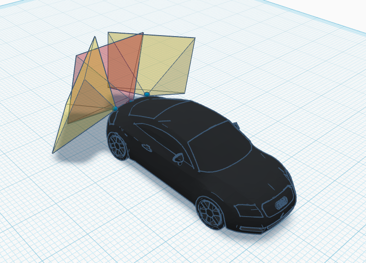
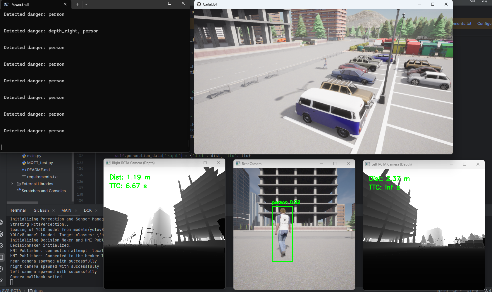

# Smart Vehicular Systems Project: Rear Cross Traffic Alert (RCTA)

## Objectives and Deliverables
Develop a Rear Cross Traffic Alert (RCTA) system to detect vehicles and pedestrians approaching 
from both sides while reversing, issuing visual and audio alerts.

The project deliverables include:
* **CARLA Code**: The complete system implementation.
* **Report**: A document describing the architecture, design choices, and results.
* **Live Demo**: A working demonstration of the system in the simulator.
* **Warning System**: Implemented via **MQTT** messages.




## Command
```
   conda create -n mobitas python=3.7
   conda activate mobitas
   pip install -r requirements.txt
   
   
   docker run -it -p 1883:1883 -p 9001:9001 --name mosquitto eclipse-mosquitto mosquitto -c /mosquitto-no-auth.conf
   docker start mosquitto
```


