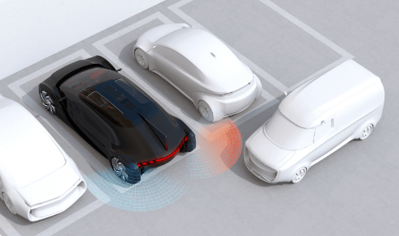

# Chapter 1: Introduction

## 1.1 RCTA - Rear Cross Traffic Alert

Rear Cross Traffic Alert (RCTA) is an Advanced Driver Assistance System (ADAS) designed to enhance vehicle safety 
during reverse maneuvers, particularly when backing out of parking spaces. 

Unlike traditional parking sensors that detect stationary obstacles directly behind the vehicle, RCTA is specifically
engineered to identify and alert drivers to moving cross traffic approaching from the sides while the vehicle is 
in reverse.

The RCTA system utilizes sensors positioned at the rear side of the vehicle to obtain environmental data and monitor 
the areas perpendicular to the vehicle's backing path. 

This lateral monitoring capability distinguishes RCTA from conventional rear parking sensors, as it focuses on 
detecting vehicles, pedestrians, or cyclists that are traveling across the vehicle's projected reverse path, rather
than objects directly in the backing trajectory.

When the system detects moving objects in the blind zones on either side of the vehicle, it calculates their distance 
and relative speed to assess the collision risk. 

If a potential collision is deemed likely to occur, the RCTA system will promptly and effectively warn the driver of 
the impending danger through acoustic alerts, optical signals (typically displayed in the side mirrors or on 
the dashboard), haptic warnings (such as seat or steering wheel vibrations), or a combination of these 
notification methods.

---

## 1.2 Motivations

The motivation for developing and standardizing RCTA systems stems from global traffic safety concerns. 
Although the overall number of traffic accidents is rising, specifically, about 2.3% of accidents occur during 
reversing or while maneuvering in a parking space. 

Distracted driving is also identified as a major factor contributing to traffic accidents. 
The utility of the RCTA system lies in its ability to mitigate these risks by promptly and effectively alerting 
drivers to impending danger, thus effectively keeping them away from the danger of rearward collision. 

___