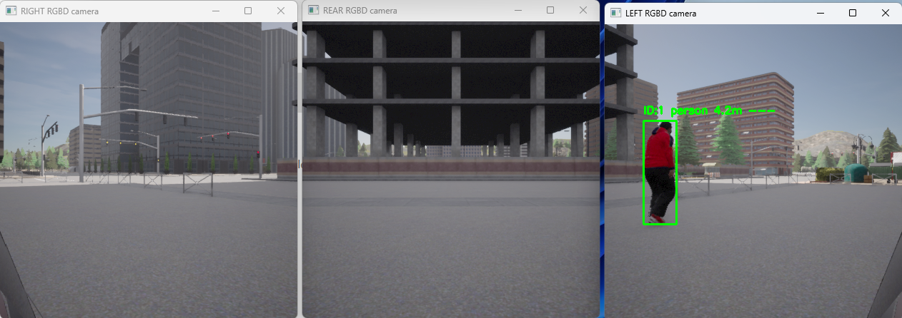

# System Architecture

## Panoramica dell'Architettura

Cosa scrivere: Inizia con un diagramma a blocchi di alto livello.

(CARLA Simulator) -> (Sensori: 3x RGBD Cam) -> (Perception Module) -> (Decision Making Module) -> (MQTT Broker) -> (HMI Display)

## Sensor configuration

Cosa scrivere: Spiega la configurazione dei sensori (simile alle sezioni 3.1-3.3 del PDF).

  

    

      
    

    

      
    

    

      
    

    

      
    

    

      
    

  

  
  <button class="carousel-btn prev" onclick="moveSlide(-1)">&#10094;</button>
  <button class="carousel-btn next" onclick="moveSlide(1)">&#10095;</button>
  
  

    
    
    
    
    
  

### Sensor used

Sensori Utilizzati: Spiega che hai usato 3 telecamere RGBD (RGB + Depth). Motiva la scelta: RGB per 
il rilevamento (YOLO) e Depth per la stima della distanza.

### Cameras positioning

Posizionamento delle Telecamere: Usa una tabella (come la 3.1 del PDF) per descrivere i parametri delle 
3 telecamere (Rear, Left, Right) presi da config.py (es. REAR_CAMERA_TRANSFORM, LEFT_CAMERA_TRANSFORM, CAMERA_FOV, ecc.).

### RCTA Sensor Configuration

| Camera    | Position (X, Y, Z)  | Resolution   | FPS   | FOV (deg)   | Rotation (Pitch, Yaw)   |
|:----------|:--------------------|:-------------|:------|:------------|:------------------------|
| **Rear**  | `(-2.0, 0.0, 0.9)`  | 416x416      | 20    | 60          | `(0, 180)`              |
| **Left**  | `(-2.0, 0.0, 0.9)`  | 416x416      | 20    | 60          | `(0, 240)`              |
| **Right** | `(-2.0, 0.0, 0.9)`  | 416x416      | 20    | 60          | `(0, 120)`              |

### Cameras view
Viste delle Telecamere: Includi screenshot delle 3 viste della telecamera (generate da cv2.imshow in main.py) 
per mostrare cosa "vede" il sistema.

