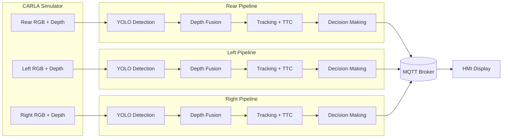

# System Architecture

## Architecture overview

The RCTA system is designed with a modular architecture, which is orchestrated by the main simulation script (main.py). 
The data flows from the CARLA simulator's sensors through perception, decision-making, and finally to the Human-Machine 
Interface (HMI). This high-level architecture is depicted in the block diagram below.

## Sensor configuration

The system's perception relies on a carefully configured set of sensors designed to provide full coverage of the rear 
cross-traffic zones. The setup is designed to mimic real-world RCTA systems, which need to monitor the blind spots 
obscured by adjacent parked vehicles.

  

    

      
    

    

      
    

    

      
    

    

      
    

    

      
    

  

  
  <button class="carousel-btn prev" onclick="moveSlide(-1)">&#10094;</button>
  <button class="carousel-btn next" onclick="moveSlide(1)">&#10095;</button>
  
  

    
    
    
    
    
  

### Sensor used

The primary sensors for this project are three RGBD cameras. 
This sensor type was chosen for its efficiency in fusing two critical data streams:
- RGB (Color) Stream: Provides the visual data necessary for the YOLOv8 object detection model to 
identify and classify relevant actors.

- Depth Stream: Provides a per-pixel distance map. This data is essential for accurately calculating the 
distance to a detected object, which is a crucial input for Time-to-Collision (TTC) calculations.

### Cameras positioning

The three cameras are placed at a common mounting point on the rear of the vehicle.
They are positioned to cover three distinct zones: Rear-Left, Rear-Center, and Rear-Right.

Their yaw angles are set to create a wide field of view, minimizing blind spots. 
The specific parameters, derived from config.py, are detailed in the following table.

| Camera    | Position (X, Y, Z)  | Resolution   | FPS   | FOV (deg)   | Rotation (Pitch, Yaw)   |
|:----------|:--------------------|:-------------|:------|:------------|:------------------------|
| **Rear**  | `(-2.0, 0.0, 0.9)`  | 416x416      | 20    | 60          | `(0, 180)`              |
| **Left**  | `(-2.0, 0.0, 0.9)`  | 416x416      | 20    | 60          | `(0, 240)`              |
| **Right** | `(-2.0, 0.0, 0.9)`  | 416x416      | 20    | 60          | `(0, 120)`              |

### Cameras view

The combined output of the three cameras provides the system with a comprehensive view of the area 
behind the vehicle. The image below shows the three camera feeds as processed by the 
perception module. 
These views are what the system uses to detect and track potential hazards.

