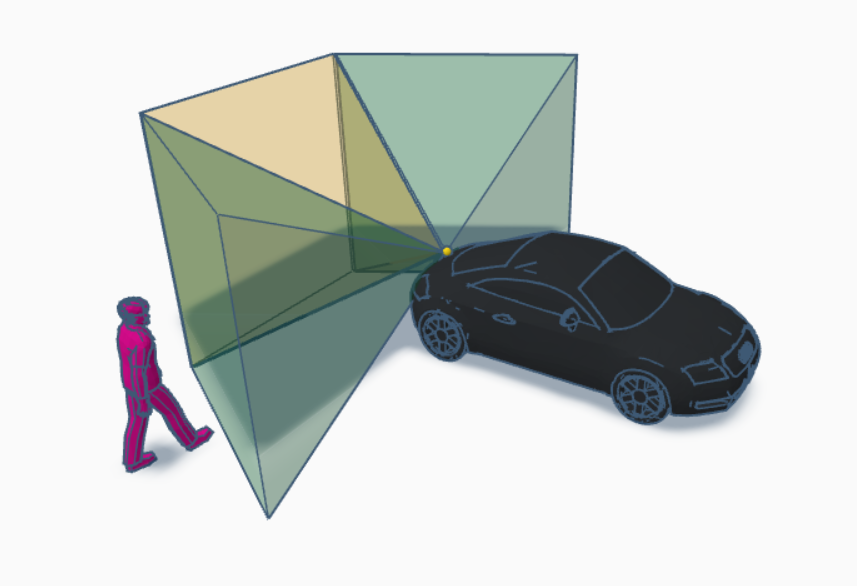
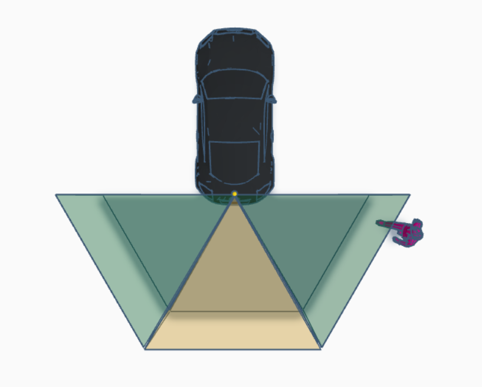
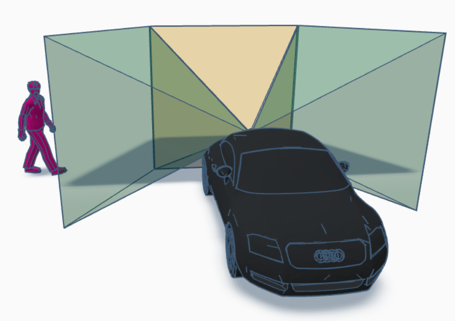
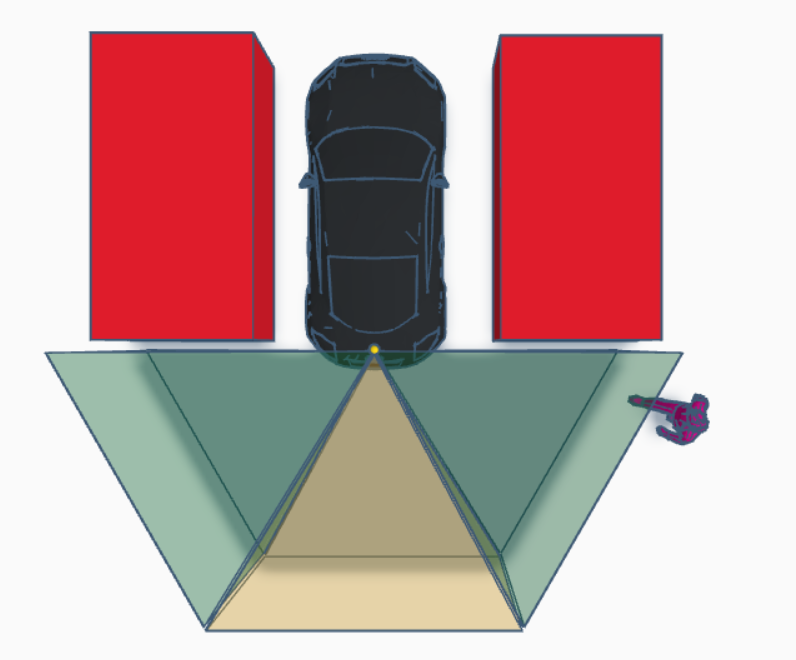
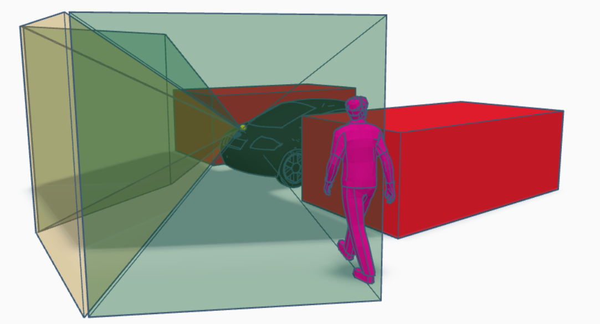

# Design of proposed solution

## Sensor used

The RCTA system utilizes the following sensors:

- **RGB Camera**: Provides color image data for object detection
- **Depth Camera**: Provides distance information for each pixel
- **RGB-D Fusion**: Combines RGB and depth data for accurate distance estimation

## Cameras positioning

<div class="carousel-container">
  <div class="carousel">
    <div class="carousel-slide active">
      
      <p class="carousel-caption">Figure 1: Camera mounting position</p>
    </div>
    <div class="carousel-slide">
      
      <p class="carousel-caption">Figure 2: Field of view coverage</p>
    </div>
    <div class="carousel-slide">
      
      <p class="carousel-caption">Figure 3: Three detection zones</p>
    </div>
    <div class="carousel-slide">
      
      <p class="carousel-caption">Figure 4: Sensor configuration</p>
    </div>
    <div class="carousel-slide">
      
      <p class="carousel-caption">Figure 5: Coverage diagram</p>
    </div>
  </div>
  
  <button class="carousel-btn prev" onclick="moveSlide(-1)">&#10094;</button>
  <button class="carousel-btn next" onclick="moveSlide(1)">&#10095;</button>
  
  <div class="carousel-dots">
    <span class="dot active" onclick="currentSlide(0)"></span>
    <span class="dot" onclick="currentSlide(1)"></span>
    <span class="dot" onclick="currentSlide(2)"></span>
    <span class="dot" onclick="currentSlide(3)"></span>
    <span class="dot" onclick="currentSlide(4)"></span>
  </div>
</div>

<style>
.carousel-container {
  position: relative;
  max-width: 800px;
  margin: 2rem auto;
  background: #f5f5f5;
  border-radius: 8px;
  overflow: hidden;
}

.carousel {
  position: relative;
  width: 100%;
  height: 500px;
}

.carousel-slide {
  display: none;
  width: 100%;
  height: 100%;
  text-align: center;
  padding: 20px;
}

.carousel-slide.active {
  display: block;
  animation: fadeIn 0.5s;
}

@keyframes fadeIn {
  from { opacity: 0; }
  to { opacity: 1; }
}

.carousel-slide img {
  max-width: 100%;
  max-height: 450px;
  object-fit: contain;
}

.carousel-caption {
  margin-top: 10px;
  font-style: italic;
  color: #555;
}

.carousel-btn {
  position: absolute;
  top: 50%;
  transform: translateY(-50%);
  background: rgba(0, 0, 0, 0.5);
  color: white;
  border: none;
  font-size: 24px;
  padding: 12px 16px;
  cursor: pointer;
  border-radius: 4px;
  transition: background 0.3s;
}

.carousel-btn:hover {
  background: rgba(0, 0, 0, 0.8);
}

.carousel-btn.prev {
  left: 10px;
}

.carousel-btn.next {
  right: 10px;
}

.carousel-dots {
  text-align: center;
  padding: 15px;
  background: #e0e0e0;
}

.dot {
  height: 12px;
  width: 12px;
  margin: 0 5px;
  background-color: #bbb;
  border-radius: 50%;
  display: inline-block;
  cursor: pointer;
  transition: background-color 0.3s;
}

.dot.active,
.dot:hover {
  background-color: #333;
}
</style>

<script>
let currentIndex = 0;

function showSlide(index) {
  const slides = document.querySelectorAll('.carousel-slide');
  const dots = document.querySelectorAll('.dot');
  
  if (index >= slides.length) currentIndex = 0;
  if (index < 0) currentIndex = slides.length - 1;
  
  slides.forEach(slide => slide.classList.remove('active'));
  dots.forEach(dot => dot.classList.remove('active'));
  
  slides[currentIndex].classList.add('active');
  dots[currentIndex].classList.add('active');
}

function moveSlide(direction) {
  currentIndex += direction;
  showSlide(currentIndex);
}

function currentSlide(index) {
  currentIndex = index;
  showSlide(currentIndex);
}

// Auto-advance ogni 5 secondi (opzionale)
// setInterval(() => moveSlide(1), 5000);
</script>

### Camera Configuration Details

The system uses three RGB-D camera pairs positioned at the rear of the vehicle:

**Rear Camera**
- Location: 2.0m behind vehicle center, 0.9m height
- Orientation: 180° (facing backward)
- FOV: 60° (covers 150° to 210°)

**Left Blind Spot Camera**
- Location: Same physical position
- Orientation: 240° (60° offset left)
- FOV: 60° (covers 210° to 270°)

**Right Blind Spot Camera**
- Location: Same physical position
- Orientation: 120° (60° offset right)
- FOV: 60° (covers 90° to 150°)

## Camera views

Each camera provides:
- **Resolution**: 416x416 pixels
- **Frame rate**: 20 FPS
- **Data output**: RGB image + depth map (0-1000m range)

## Sensors purpose

| Sensor | Purpose |
|--------|---------|
| RGB Camera | Object detection and classification using YOLOv8 |
| Depth Camera | Distance measurement for detected objects |
| RGB-D Fusion | Accurate 3D localization and TTC calculation |

## Computer vision algorithm for detection

### Detection Pipeline

1. **Image Acquisition**: Capture synchronized RGB and depth frames
2. **Object Detection**: YOLOv8 nano model detects vehicles, pedestrians, and bicycles
3. **Object Tracking**: Maintains consistent IDs across frames
4. **Distance Estimation**: Extracts depth values from bounding box ROI (10th percentile)
5. **Velocity Calculation**: Computes relative velocity from consecutive measurements
6. **TTC Computation**: Calculates Time-To-Collision when velocity > 0.5 m/s
7. **Alert Generation**: Triggers WARNING (dist < 3m) or DANGER (TTC < 2.5s)

### Algorithm Parameters

- **Detection confidence**: 0.5
- **Target classes**: person, bicycle, car, bus, truck
- **Precision mode**: FP16 (half precision)
- **Track persistence**: 1.0 second

## Event publishing in MQTT broker

### MQTT Architecture

- **Broker**: Eclipse Mosquitto (localhost:1883)
- **Topic**: `rcta/alerts`
- **Message format**: JSON

### Message Structure

**Alert Message**:
```json
{
  "alert": true,
  "objects": [
    {
      "zone": "left|rear|right",
      "alert_level": "warning|danger",
      "class": "car|person|bicycle|bus|truck",
      "distance": 2.5,
      "ttc": 1.8
    }
  ]
}
```

**Safe Message**:
```json
{
  "alert": false,
  "objects": []
}
```