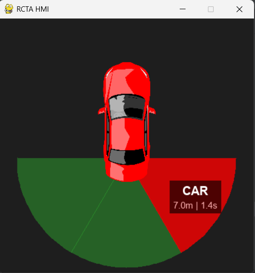

# Solution implementation

## Perception Module

This module serves as the core system, tasked with understanding the 
environment through sensor data.

### Object Detection 
The system employs the YOLOv8n (nano) architecture for object detection,
chosen for its real-time performance. The model is initialized using
weights pre-trained on the COCO dataset, ensuring robustness in recognizing
common actors. To reduce noise, the detector filters results to only 
include specific target classes: person, bicycle, car, bus, and truck. 

Crucially, the system utilizes the model.track method with persist=True,
which assigns and maintains a unique numerical ID for every detected 
object across frames, enabling the calculation of velocity and trajectory.

### Depth processing 
Distance estimation relies on the depth camera stream. 

CARLA outputs depth information encoded in a standard 3-channel RGB image.
The _decode_depth_to_meters function converts this raw data into a metric
float matrix. 

It applies the standard decoding formula:
normalized = (R + G * 256 + B * 256 * 256) / (256^3 - 1) * 1000. 

To ensure this heavy pixel-wise operation does not bottleneck 
the main loop, the function is optimized using the @numba.jit 
decorator for just-in-time compilation.

### Fusione Sensoriale (RGB+D): 
The _fuse_results function bridges the gap between the 2D 
detections and 3D depth map. For each bounding box identified by YOLO:

- The coordinates are used to extract a corresponding Region of Interest 
(ROI) from the decoded depth map.

- To estimate the distance robustly, the system calculates the 
10th percentile of the depth values within that ROI 
(np.percentile(roi, 10)).
This approach is significantly more reliable than using the mean or 
median, as it correctly identifies the closest point of the 
object (e.g., the bumper of a car) while filtering out background 
pixels that might be included in the bounding box.

### Tracking e Calcolo TTC: 
To assess danger, the system must know how fast an object is approaching.
The _update_tracks_and_calc_ttc function manages this by storing the 
history of every object ID in dictionaries (e.g., tracked_objects_rear). 

By comparing the object's current distance and timestamp against its 
previous state, the system calculates the relative velocity 
(delta_d / delta_t). If the object is approaching (rel_velocity > 0.5),
the Time-to-Collision (TTC) is computed as current_distance / relative_velocity.

## Decision module 
This module processes the fused perception data to determine if an
alert is necessary.

### Evaluation Logic
The core logic resides in the evaluate method of the DecisionMaker class.
As a preliminary check, it verifies if the ego vehicle is currently reversing (is_reversing flag). 
If the vehicle is not in reverse, the system suppresses all alerts and returns an empty list.

### Alert Generation
The system iterates through the data from all three zones 
(left, rear, right) and applies a two-tier threshold logic to
generate alerts:

- Danger Level (TTC): If an object's projected Time-to-Collision is 
lower than the TTC_THRESHOLD (defined as 2.5 seconds in config.py),
the system triggers a "danger" alert. In this scenario, it prioritizes 
the object with the lowest TTC.

- Warning Level (Distance): If no TTC violation is detected, 
the system checks the physical distance. 
If an object is closer than the DIST_THRESHOLD (defined as 3.0 meters 
in config.py), a "warning" alert is triggered.

### Output Format
The function returns a dangerous_objects_list, which is a list of dictionaries ready for MQTT transmission. 
The structure ensures the HMI receives all necessary context:

```
{
    "zone": "rear",          # The detection zone (left/rear/right)
    "alert_level": "danger", # Priority level
    "class": "car",          # Object type
    "distance": 4.5,         # Current distance in meters
    "ttc": 1.2               # Time to collision in seconds
}
```

## Comunicazione e HMI (MQTT)

This module handles the communication of alerts from the main simulation to the end-user interface. 
This is achieved using an MQTT (Message Queuing Telemetry Transport) broker, 
which decouples the perception system from the display.

### MQTT Publisher
The MqttPublisher class, defined in mqtt_publisher.py, manages the connection to the MQTT broker 
specified in the config.py file. It handles connection establishment (connect) and runs a background network loop
(self.client.loop_start()) to manage publishing messages asynchronously.

The primary function is publish_status(dangerous_objects_list). This method receives the 
list of threats directly from the DecisionMaker module. It then constructs a JSON
payload to be sent to the MQTT_TOPIC_ALERTS topic.

The payload format is binary, based on whether any threats are present:

- If no threats are found (the list is empty), it publishes a "safe" message:

```JSON
{"alert": false, "objects": []}
```

- If threats are detected, it publishes an "alert" message containing the list of dangerous objects:

```JSON
{"alert": true, "objects": [...]}
```

The objects list contains detailed dictionaries for each object, including its zone, alert_level, class, distance, and ttc.

### HMI Display

The hmi_display.py script is a standalone Pygame application that functions as the 
MQTT client for the driver's interface. It runs as a completely separate process 
from the main CARLA simulation. It initializes its own MQTT client and subscribes
to the same MQTT_TOPIC_ALERTS topic, listening for the JSON messages published by
the MqttPublisher.



Message Callback (_on_message) When a new message arrives from the broker,
the _on_message callback function is triggered. This function is responsible 
for parsing the incoming JSON payload.

- It first creates a new_data dictionary, resetting all zones to 'SAFE' by default.

- If the payload's "alert" key is True, it iterates through the "objects" list.

- For each object, it updates the corresponding zone (left, rear, or right) in new_data with its state (alert level), label (class), dist, and ttc.

- The logic correctly prioritizes 'DANGER' over 'WARNING'.

- Finally, it atomically updates the global radar_data variable, which the main Pygame loop uses for drawing.
