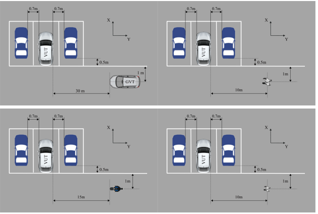
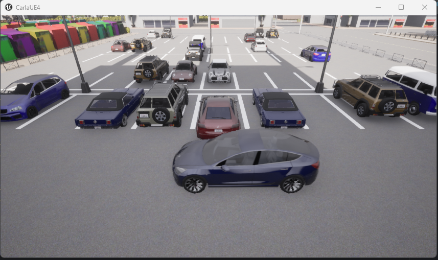
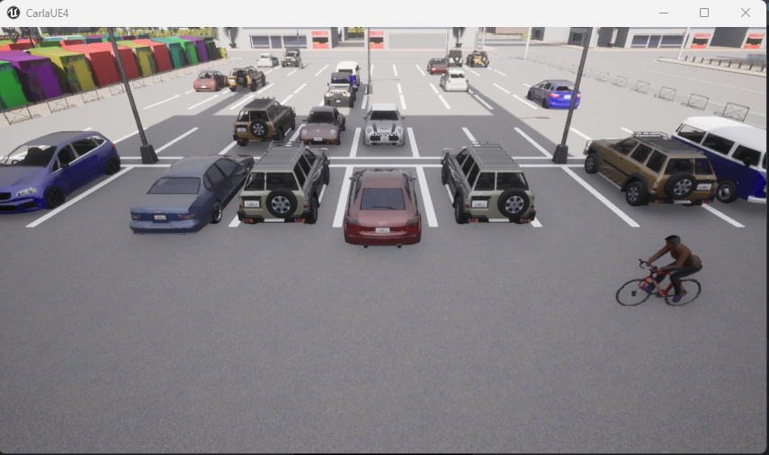
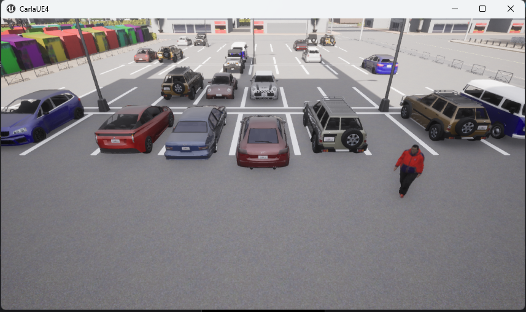
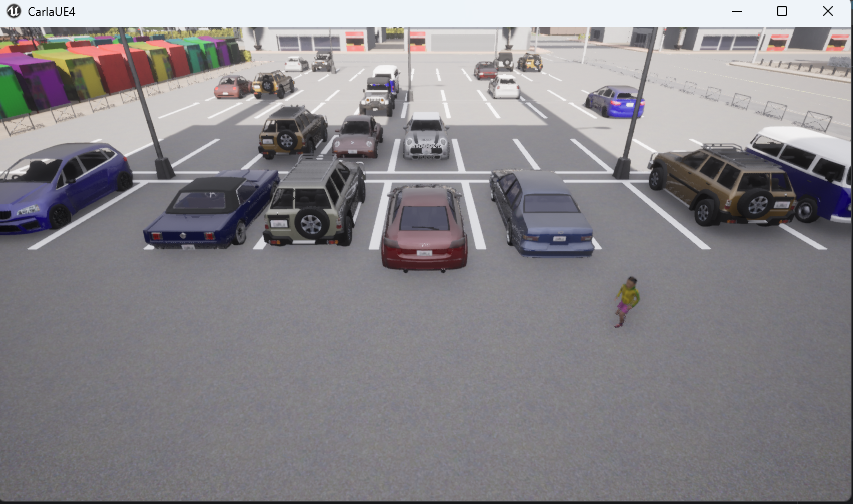

# Test and Result
The testing methodology is adapted from the scientific article [Study on Test and Evaluation Method 
of Rear Cross Traffic Alert System](https://www.spiedigitallibrary.org/conference-proceedings-of-spie/13018/130181I/Study-on-test-and-evaluation-method-of-rear-cross-traffic/10.1117/12.3024096.full). 

Following this standard, we established a baseline geometric 
setup where the Vehicle Under Test (VUT) is placed in a parking spot, in reverse gear, and kept stationary.


## Scenarios of test
To simulate real-world blind spots, two blocking vehicles are parked immediately adjacent to the VUT. 

This configuration forces the sensors to detect targets emerging from occlusion,
testing the system's reaction time and field of view.



We implemented four distinct dynamic scenarios, defined in ```parking_lot_scenario.py```, 
to cover different target sizes and speeds:

- **Vehicle Crossing**: A target vehicle crosses behind the VUT at 15 km/h. 
This tests the system's ability to track large, fast-moving objects.

- **Cyclist Crossing**: An adult cyclist crosses at speeds of 10 km/h . 
This represents a medium-speed target with a smaller radar/visual cross-section.

- **Pedestrian Adult**: An adult pedestrian walks across the path at 5 km/h.

- **Pedestrian Child**: A child pedestrian model crosses at 7. 
This is the most critical scenario due to the target's small size and potential to be 
completely obscured by the blocking vehicles.

<div class="carousel-container">
  <div class="carousel">
    <div class="carousel-slide active">
      
    </div>
    <div class="carousel-slide">
      
    </div>
    <div class="carousel-slide">
      
    </div>
    <div class="carousel-slide">
      
    </div>
  </div>
  
  <button class="carousel-btn prev" onclick="moveSlide(-1)">&#10094;</button>
  <button class="carousel-btn next" onclick="moveSlide(1)">&#10095;</button>
  
  <div class="carousel-dots">
    <span class="dot active" onclick="currentSlide(0)"></span>
    <span class="dot" onclick="currentSlide(1)"></span>
    <span class="dot" onclick="currentSlide(2)"></span>
    <span class="dot" onclick="currentSlide(3)"></span>
    <span class="dot" onclick="currentSlide(4)"></span>
  </div>
</div>

<style>
.carousel-container {
  position: relative;
  max-width: 800px;
  margin: 2rem auto;
  background: #f5f5f5;
  border-radius: 8px;
  overflow: hidden;
}

.carousel {
  position: relative;
  width: 100%;
  height: 500px;
}

.carousel-slide {
  display: none;
  width: 100%;
  height: 100%;
  text-align: center;
  padding: 20px;
}

.carousel-slide.active {
  display: block;
  animation: fadeIn 0.5s;
}

@keyframes fadeIn {
  from { opacity: 0; }
  to { opacity: 1; }
}

.carousel-slide img {
  max-width: 100%;
  max-height: 450px;
  object-fit: contain;
}

.carousel-caption {
  margin-top: 10px;
  font-style: italic;
  color: #555;
}

.carousel-btn {
  position: absolute;
  top: 50%;
  transform: translateY(-50%);
  background: rgba(0, 0, 0, 0.5);
  color: white;
  border: none;
  font-size: 24px;
  padding: 12px 16px;
  cursor: pointer;
  border-radius: 4px;
  transition: background 0.3s;
}

.carousel-btn:hover {
  background: rgba(0, 0, 0, 0.8);
}

.carousel-btn.prev {
  left: 10px;
}

.carousel-btn.next {
  right: 10px;
}

.carousel-dots {
  text-align: center;
  padding: 15px;
  background: #e0e0e0;
}

.dot {
  height: 12px;
  width: 12px;
  margin: 0 5px;
  background-color: #bbb;
  border-radius: 50%;
  display: inline-block;
  cursor: pointer;
  transition: background-color 0.3s;
}

.dot.active,
.dot:hover {
  background-color: #333;
}
</style>

<script>
let currentIndex = 0;

function showSlide(index) {
  const slides = document.querySelectorAll('.carousel-slide');
  const dots = document.querySelectorAll('.dot');
  
  if (index >= slides.length) currentIndex = 0;
  if (index < 0) currentIndex = slides.length - 1;
  
  slides.forEach(slide => slide.classList.remove('active'));
  dots.forEach(dot => dot.classList.remove('active'));
  
  slides[currentIndex].classList.add('active');
  dots[currentIndex].classList.add('active');
}

function moveSlide(direction) {
  currentIndex += direction;
  showSlide(currentIndex);
}

function currentSlide(index) {
  currentIndex = index;
  showSlide(currentIndex);
}

// Auto-advance ogni 5 secondi (opzionale)
setInterval(() => moveSlide(1), 5000);
</script>


To evaluate the robustness of the RCTA system, 
each of the four scenarios above was tested under two distinct environmental conditions:

- Ideal Conditions ```bad_weather=False```: Clear noon weather with optimal lighting and visibility.

- Adverse Conditions ```bad_weather=True```: Heavy rain and fog. This tests the degradation of 
the RGB camera's visibility and the depth camera's clarity, simulating a worst-case real-world situation.

## Evaluation Metrics 

The main quantitative parameter for evaluation is the time to collision (TTC) at the moment of the first alarm.
According to the reference study, an effective RCTA system must activate an alarm when the TTC is greater than
1.7 seconds. Our system uses a more conservative safety threshold of 3.5 seconds to ensure 
an adequate safety margin.

Another qualitative parameter is detection accuracy: it checks whether the specific class has been correctly
identified by YOLO despite the occlusion caused by cars blocking the view.

## Analysis of results

[Video Result](https://drive.google.com/drive/folders/1lnfjyTRItry3ehBIEFgoYkfPKbvRfLZF?usp=sharing)

**TO DO**

- Impatto Meteo Avverso: 
Il meteo avverso non ha ridotto l'accuratezza di YOLO o la precisione della mappa di profondità

- Come si è comportato il sistema quando l'attore era parzialmente nascosto dalle blocking_cars?


